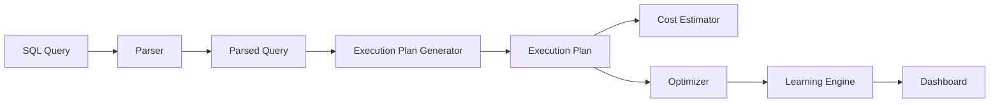

# SQLIQ – Interactive SQL Query Intelligence Platform

<b>Parse • Visualize • Optimize • Learn • Prepare</b>

---

## 📖 Overview

**SQLIQ** is an educational DBMS-inspired platform that helps users understand how SQL queries are parsed, optimized, and executed internally. It combines execution plan visualization, query optimization, SQL learning, and interview preparation in one application.

## ✨ Key Highlights

- SQL Parser
- Execution Plan Generator
- Rule-Based Query Optimizer
- Cost Estimation Engine
- SQL Intelligence & Learning Center
- Query Complexity Analyzer
- Interview Preparation
- Progress Tracker

## 🚀 Features

### DBMS Engine
- SQL Parser
- Execution Plan Generator
- Relational Algebra Tree
- Cost Estimation
- Original vs Optimized Plans

### Learning Center
- SQL Concept Explainer
- Syntax Advisor
- Query Approach Guide
- Learning Hints
- Interview Questions

### Analytics
- Complexity Analysis
- Query Health Score
- Optimization Score
- Cost Reduction Analysis

## 🏗️ Architecture

## ⚙️ Workflow

1. Enter SQL Query
2. Parse Query
3. Generate Execution Plan
4. Estimate Cost
5. Optimize Query
6. Generate Learning Insights
7. Display Results

## 🛠️ Tech Stack

| Category | Technology |
|----------|------------|
| Frontend | React + TypeScript |
| Styling | Tailwind CSS |
| Concepts | SQL, DBMS, Query Optimization |

## 📸 Screenshots

Add your screenshots here.

## 🔮 Future Scope

- Cost-Based Optimizer
- Window Functions
- CTE Support
- Real Database Integration
- Performance Benchmarking

## ⭐ If you found this project useful, consider giving it a star!
